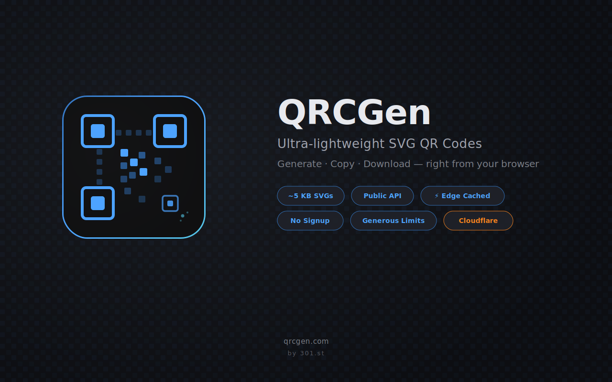

# QRCGen

QR code generator browser extension — side panel UI, share links, embed snippets and offline preview.

[](#)
[](#)
[](LICENSE)
[](#)
[](#)

## Features

- **Side panel UI** — always accessible, doesn't block the page
- **Instant preview** — QR generated locally via `uqr`, no network needed
- **~5 KB SVGs** — run-length encoded, single `<path>`, integer coordinates
- **Share links** — canonical URLs at `qr.qrcgen.com` with CDN edge caching
- **Embed snippets** — HTML, Markdown, React, Vue formats
- **History** — recent QR codes stored locally
- **Dark & light theme** — with auto-detection
- **2 languages** — English, Russian
- **Fully local** — no accounts, no tracking, no data leaves your browser

## Install

| Browser | Link |
|---------|------|
| Chrome | Coming soon |
| Edge | Coming soon |

## How It Works

1. Click the extension icon — side panel opens with a QR code for the current page
2. QR matrix generated **locally** with `uqr` — instant, offline
3. SHA-256 hash computed locally (same algorithm as the API worker)
4. Canonical URL built deterministically — no API call needed
5. Background worker warms the CDN edge cache (fire-and-forget)
6. Copy share link, download SVG, or grab an embed snippet

## Development

```bash
git clone https://github.com/investblog/qrgen.git
cd qrgen
npm install

npm run dev            # Chrome dev build with HMR
npm run dev:edge       # Edge dev build
npm run build          # Chrome production
npm run build:all      # Chrome + Edge production
npm run zip:all        # Distribution archives
npm run check          # typecheck + lint + test
```

## Tech Stack

- [WXT](https://wxt.dev) ^0.19 — web extension framework with HMR
- TypeScript ^5.7
- [uqr](https://github.com/unjs/uqr) — QR matrix generation (zero deps)
- Vanilla DOM — no React/Vue runtime
- [Biome](https://biomejs.dev) — linter & formatter
- [Vitest](https://vitest.dev) — test runner (32 tests)
- Chrome MV3 + Edge MV3 builds

## Privacy

QRCGen runs entirely in your browser. QR codes are generated locally — no data is sent for preview. The only network request is an optional cache-warming fetch to `qr.qrcgen.com` so share links load instantly for recipients. No accounts, no tracking, no analytics.

## Related

- [qr-generator](https://github.com/investblog/qr-generator) — Cloudflare Worker API at `qr.qrcgen.com`
- [qrcgen.com](https://qrcgen.com) — web UI & documentation
- [API docs](https://qrcgen.com/docs/qr-api) — endpoint reference
- [Extension guide](https://qrcgen.com/docs/qr-extension) — user documentation

## License

[MIT](LICENSE)

---

Built by [investblog](https://github.com/investblog) with [Claude](https://claude.ai)
